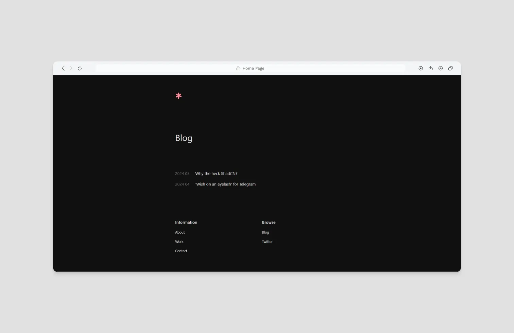

# Sakura Astro
This is a minimal blog template, inspired from a [dribbble post](https://dribbble.com/shots/23563106--blog) by [Nicolas Solerieu](https://dribbble.com/SLRNCL). This is solely focused on writing blogs from your text editor(like a real developer).

I'm working on this template, so I'll see some breaking changes sometimes! ;)

## Features

1. Minimal theme with page transitions and smooth scroll
2. Ships with no client-side logic
3. support for RSS, Image optimisation and OpenGraph Images
4. Small bundle size around ~ 3KB

## Routes Defined

1. Index page `/`
	The landing page which summarizes about you.

2. Work page `/work`
	Here, you can mention about your past experiences or projects that you've been working on.

3. Contact page `/contact`
	It holds links to all your socials and work.

4. About page `/about`
	Here, you can ramble long about yourself and what you like.

5. Blog page `/blog`
	Contains list of all written blogs under `/src/pages/posts` folder.

6. 404 page `/*-unknown`
	There is also a custom 404 page.

7. RSS feed `/rss.xml`
	Dedicated rss route.

## How to change

You can change the data by checking out respective pages under `/src/pages` folder. The files represent the corresponding routes in the application. Copy and Paste!

All the blogs are written under the `/src/pages/posts` folder. Do check out the front-matter for blog before starting to write a new one. Also, you can add og-images in `/public/blogs` folder and link them up in the front-matter.

To check further refer to `CHANGELOG.md`. It will also explains changes brought in by each update.

## Found a bug

Report it under `issues` tab. Be clear about it and do list steps to reproduce it.

## Want to add something?
I would love to accept contributions. And now how?

1. Open an issue regarding feature or bug fix
2. Fork it - Branch it `<feat>-<name>`
3. Work and submit a PR

Thank you!