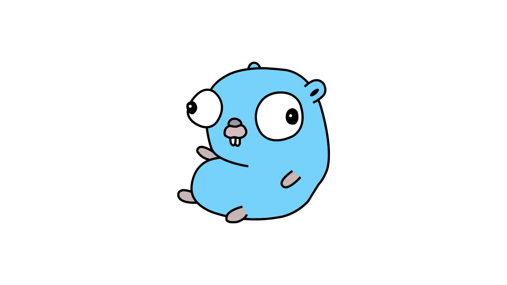

## Introduction

After spending years doodling in Python, writing brilliant one-file essays and crying over why the interpreter gave off an error on line 42 when there was nothing on line 42, I decided to pick up a more comprehensive language to address issues I've always carried in my heart so long as a Java grown-up.

Issues like:

1. No concrete data typing
2. Automatic type upgradation
3. Too much langauge to remember
4. Ease of use

And many more, so I choose to ride the hype train around the new languages. I started out with Rust, and later due to weird reasons I also picked up Go. Plus, the newer langauges provide more cleaner APIs and better decision on language syntax. Such design choices provide more sublime writing experience and 10x better legibility.

New languages also bring up better architecture solutions like inbuilt-concurrency, better garbage collection and some of the most annoying lexemes.

## A bit about me

I'm a web developer who loves building cool web tools like parsers, frameworks, and libraries. I've created web servers for APIs, SVG badges, and web scrapers to make things run smoothly and efficiently. I work with tools like TypeScript, Node.js (and recently Bun), Python and its friends, Docker, Git CI/CD, and everything in between.

> Fun Fact: esbuild, written in Go back in 2020 and designed to run on a single thread, still managed to outperform every other bundler of its time.

For the past year, I've been studying Rust and Go, but I was uncertain which one to keep and which one to discard. I picked up both because of the trends and hype surrounding them. However, I finally settled on Go, and here's why.

## Go Features

Few features of go which made me pick it over rust:

1. `go func`

   The inbuilt concurrency model and its simplicity of usuage was the real pivot. Plus, these lightweight threads only weigh `2KB`. Including channels, mutexes, wait groups and comprehensive sync library it makes an excellent choice to get started with concurrency without any fear.

   Goroutines example.

   ```go
   package main
   import (
    "fmt"
    "time"
   )

   func say(message string, done chan bool) {
    fmt.Println(message)
    time.Sleep(time.Second) // Simulate some work
    done <- true            // Signal completion
   }

   func main() {
    done := make(chan bool)

    go say("Hello, Concurrent World!", done)

    <-done // Wait for the goroutine to finish
    fmt.Println("Finished!")
   }
   ```

   Although waiting on channels isn't the best way to await function's execution, it works. Writing concurrent functions feels like second nature to me.

2. `cleaner grammar`

   Go offers a much more cleaner and legible syntax for developers. The only plot twist is of square brackets being added before the data type instead of after it, when writing array types.

   Try reading this. (code snippet written in Rust)

   ```rust
   // A function that combines lifetimes, generics, and traits
   fn describe_and_transform<T, U>(item: &T) -> U
   where
    T: Transform<Output = U> + std::fmt::Debug,
    U: std::fmt::Display,
   {
    println!("Item description: {:?}", item.describe());
    item.transform()
   }
   ```

   It is hard to read and understand. I know the wizards of Rust would object to the above statement. Nonetheless, if writing rust is not fun, why should I pick it then. Go wins this battle. It has far more cleaner API, leaner syntax and simple writing style whether it be functions, interfaces or modules.

3. `lack of features`

   This might sound contradictory, but Go lacks a ton of features, which, in a way, is great. Features like **OOP, macros, weaker generics support, and the absence of first-class functions** are often yearned for. Personally, I miss OOP the most, as I was born and raised in the Java ecosystem.

   The concept of structs is alien to me. I understand everything through the lens of the classes-and-objects pattern, namely _the factory pattern_. Even while writing JavaScript, I knew that everything is an object and classes are just syntactic sugar. Still, it made it 100 times easier for me to model traits and behavior using classes syntax.

   It also ensures that you're more focused on building things rather than choosing best tool for the work.

These three reasons were enough for me to save myself from the brutality of Rust and write simpler code. That said, both programming languages offer excellent dependency management solutions and first-class support from their communities.

Picking either of them without any prior biases would be super easy for newcomers. And if you're not overthinking it, just choose one and let it grow on you!

_Keep it PG._

---

## Data Structures

As a CS undergraduate, I also solve coding problems in the language to understand the inner workings of it better. Like implementing a tree data structure in it. Let’s take a look at how both languages implement the same structure.

1.  `Rust`
    implementing tree data structure using cyclic referencing and mutable references.

    ```rust
    use std::rc::Rc;
    use std::cell::RefCell;

    #[derive(Debug)]
    struct TreeNode<T> {
        value: T,
        children: Vec<Rc<RefCell<TreeNode<T>>>>,
    }

    impl<T> TreeNode<T> {
        fn new(value: T) -> Rc<RefCell<Self>> {
            Rc::new(RefCell::new(TreeNode {
                value,
                children: Vec::new(),
            }))
        }

        fn add_child(parent: Rc<RefCell<Self>>, child: Rc<RefCell<Self>>) {
            parent.borrow_mut().children.push(child);
        }
    }

    fn main() {
        let root = TreeNode::new(1);
        let child1 = TreeNode::new(2);
        let child2 = TreeNode::new(3);

        TreeNode::add_child(root.clone(), child1.clone());
        TreeNode::add_child(root.clone(), child2.clone());

        println!("{:#?}", root);
    }

    ```

2.  Now `Go`
    implementing the same using simple pointers and structs.

    ```go
    package main

    import "fmt"

    type TreeNode[T any] struct {
        Value    T
        Children []*TreeNode[T]
    }

    func NewTreeNode[T any](value T) *TreeNode[T] {
        return &TreeNode[T]{Value: value}
    }

    func (n *TreeNode[T]) AddChild(child *TreeNode[T]) {
        n.Children = append(n.Children, child)
    }

    func main() {
        root := NewTreeNode(1)
        child1 := NewTreeNode(2)
        child2 := NewTreeNode(3)

        root.AddChild(child1)
        root.AddChild(child2)

        fmt.Printf("%+v\n", root)
    }

    ```

The Rust version heavily relies on generic types, as well as the memory safety and mutability guarantee APIs. To ensure all of this, the code grows in size as well.

On the other hand, Go simply relies on old C-style pointers to get the structure up. Although the `methods` for the `TreeNode` struct don't provide excellent visual segregation like the `impl` block, they help in keeping the implementation minimal in terms of lexemes.

You can imagine how deep the rabbit hole goes for Rust programmers when tackling graph algorithms.

---

## Conclusion

Now, one could easily point out the greater memory safety provided by Rust over Go and tell me a thousand ways in which Rust supersedes Go. I admit them all. However, Rust fails to provide a _simpler DX, simpler concepts, and sacrifices code readability and legibility._

Rust has been taking the web development world by storm, especially for frontend tooling. Still, I’m sticking with Go—I just hope I’m not missing out on anything!

For me, these factors ensure that your code will remain future-proof in terms of human beings. But if AI takes over, I don't know. ;)

PS: In future I'll write a part two of this post, when I'd spent enough time writing Go.
