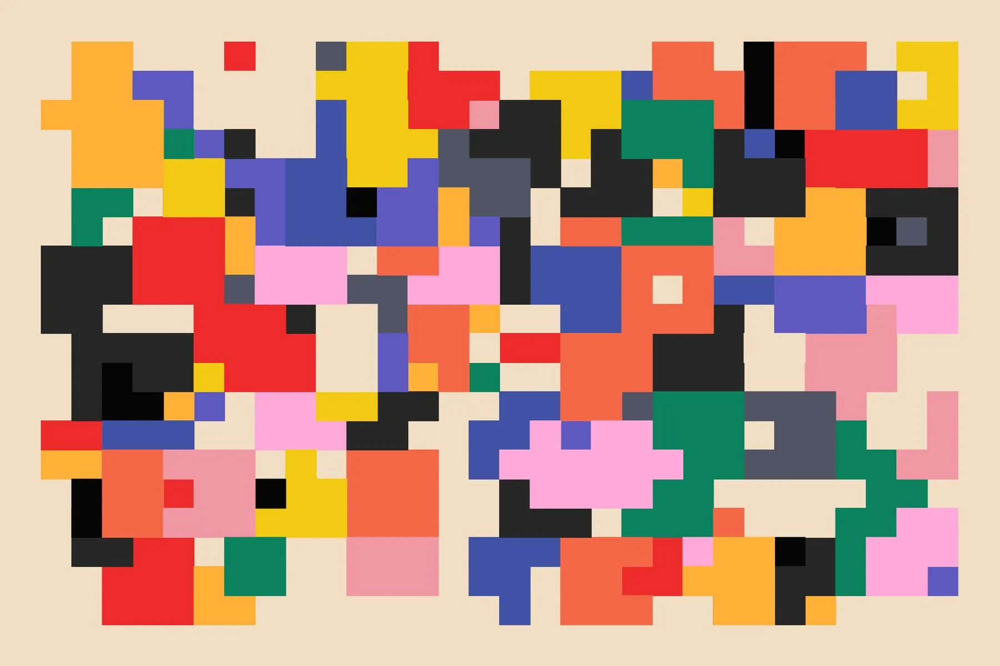

Let me put it straight: you're overdosing on hooks. Even your IDs and keys are living as state in your React app. `useState` hooks trigger a side effect of updating the virtual DOM whenever the state changes. Storing irrelevant data as state is bad for performance.

Not all cases can be solved with generators. However, you can replace complex hook patterns with generators to simplify the logic, making it more manageable and extendable.

## TL;DR

Use generators to generate data dynamically in React components. Generators can simplify the logic and reduce reliance on hooks.

---

I'll present a simple example to help you understand where and when to use generators.

## What are generators?

Generators are functions that can be paused and resumed. They are created using a `function*` declaration and `yield` expressions.

```javascript
function* generator() {
  yield 1;
  yield 2;
  yield 3;
}

const gen = generator();
console.log(gen.next()); // { value: 1, done: false }
console.log(gen.next()); // { value: 2, done: false }
console.log(gen.next()); // { value: 3, done: false }
console.log(gen.next()); // { value: undefined, done: true }
```

You can use them to iterate over a collection of data or to generate a sequence of data, which, in turn, could be used to render content inside components.

Still confused? Let's build a simple example to understand the use of generators.

## Headline Example

Let's say you have a list of headlines that you want to render in your component.

```javascript
const headlines = [
  "Local Shops Thrive",
  "Team Wins Finals",
  "Stay Flu-Free",
  "New Phone Launch",
  "Sunny Week Ahead",
];
```

You can do it by iterating over the headlines array and rendering each headline inside the component, via storing the index as a state variable.

```tsx
import { useState } from "react";

const Headlines = () => {
  const [index, setIndex] = useState(0);

  return (
    <div>
      <h1>{headlines[index]}</h1>
      <button onClick={() => setIndex((index + 1) % headlines.length)}>
        Next
      </button>
    </div>
  );
};
```

This works well until you have a linear array of headlines that you want to iterate over and display repeatedly. Now, what if you want to create a pattern with your headlines? For instance, first, display a greeting message based on the time of day, then display the day of the week, and finally follow up with a random motivational thought.

```javascript
const headlines = [
  "Good Morning", // Greeting message
  "Today is Monday", // Day of the week
  "Stay positive", // Motivational thought
];
```

Now, you can't simply iterate over a set of static data. Instead, you need to compute each headline dynamically.

But you're the megamind. You come up with an idea: why not create three functions that compute each part of the pattern and use their output as the render text?

```javascript
function getGreetingMessage() {
  const hours = new Date().getHours();
  if (hours < 12) {
    return "Good Morning";
  } else if (hours < 18) {
    return "Good Afternoon";
  } else {
    return "Good Evening";
  }
}

function getDayOfTheWeek() {
  const days = [
    "Sunday",
    "Monday",
    "Tuesday",
    "Wednesday",
    "Thursday",
    "Friday",
    "Saturday",
  ];
  return `Today is ${days[new Date().getDay()]}`;
}

function getMotivationalThought() {
  const thoughts = ["Stay positive", "Keep going", "You're awesome"];
  return thoughts[Math.floor(Math.random() * thoughts.length)];
}
```

Now, you can use these functions to render the headlines inside the component.

```tsx
import { useState } from "react";

const Headlines = () => {
  const pattern = [getGreetingMessage, getDayOfTheWeek, getMotivationalThought];
  const [index, setIndex] = useState(0);

  return (
    <div>
      <h1>{pattern[index]()}</h1>
      <button onClick={() => setIndex((index + 1) % pattern.length)}>
        Next
      </button>
    </div>
  );
};
```

Have you noticed something? You changed the entire logic of your component. To simplify the logic and keep your components clean, you can use generators.

```javascript
function* patternGenerator() {
  yield getGreetingMessage();
  yield getDayOfTheWeek();
  yield getMotivationalThought();
}

const pattern = patternGenerator();
```

Now, you can use this generator to render the headlines inside the component.

```tsx
import { useState } from "react";

const Headlines = () => {
const [index, setIndex] = useState(0);

    return (
    	<div>
    		<h1>{pattern.next().value}</h1>
    		<button onClick={() => setIndex((index + 1) % 3}>Next</button>
    	</div>
    );

};
```

This way, you can keep your components clean and your logic simple. Generators can be used to simplify the logic and give hooks a break.

Generators also abstract the logic behind how the data is generated. Plus, you can easily extend the pattern by adding more functions to the generator or changing the order of the functions without altering the logic inside the component.

To take a step forward you can also create a custom hook to handle the generator logic.

```tsx
import { useState } from "react";

function useGenerator(generator) {
  const [gen, setGen] = useState(generator());

  return () => gen.next().value;
}

const Headlines = () => {
  const pattern = useGenerator(patternGenerator);

  return (
    <div>
      <h1>{pattern()}</h1>
    </div>
  );
};
```

This also ensures that the API for the generator remains consistent across components no matter how the logic shifts inside the generator.

Hence, they provide more flexibility and control over the data generation process.

### Benefits of using generators:

1. Simplify component logic with a consistent API and separation of concerns between data generation and rendering.
2. Enable on-demand data generation to minimize state usage and avoid unnecessary data storage.
3. Provide fine-grained control and a flexible, extendable approach to data generation.

### Points to Remember

1. Generators are not exclusive to React but are a pure JavaScript feature.
2. The pause-and-resume functionality of generators makes them memory-efficient.
3. They do not generate side effects or trigger irregular updates or mutations.

Now I'm in my happy place!

## Conclusion

Generators help streamline the process of data serving and separate concerns between data generation and rendering components, offering greater control and flexibility over data generation without compromising performance.

You can also checkout this great talk by [Anjana Vakil](https://x.com/AnjanaVakil) on [Generators in JavaScript](https://youtu.be/gu3FfmgkwUc).

I hope this article helps you understand where and when to use generators. If you have any questions or feedback, feel free to reach out to me on [Twitter](https://twitter.com/ashishk1331).
